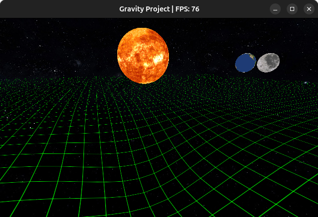

OpenGL experiment on 3D rendering.

Graphical simulation of gravity effects on massive objects (without using precise values).

Use <kbd>F1</kbd> to lock the camera, <kbd>Space</kbd> to move up, <kbd>Shift</kbd> to move down, and arrow keys to move around.

